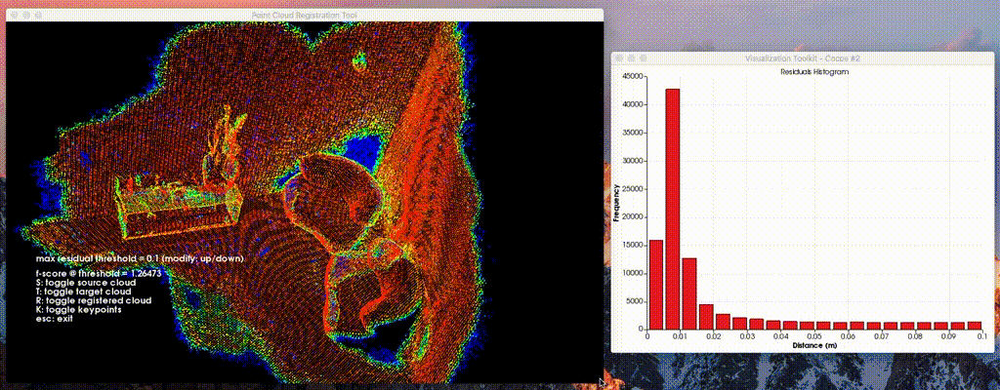

Point Cloud Registration Tool
====
Automatically registers (aligns) and visualizes point clouds, or processes a whole bunch at once

### Main Features:
* Coarse-to-fine registration (correspondence-based followed by ICP refinement)
* PLY/OBJ input support
* GUI
* Batch processing
* Parallelized
* Outputs to disk:
  * Registered cloud with residual colormap
  * Transformation matrix
  * [F-score](https://en.wikipedia.org/wiki/F1_score)
  * Histogram of residuals (in GUI mode)

### Demo:


Each point is colored proportional to its distance to the closest point on the target cloud.

Color range of the residual colormap: RED = 0cm, BLUE = maximum residual threshold (default: 10cm)

Up/down arrow keys adjust the: maximum residual threshold.

### Install:

#### Ubuntu 14.04:

If you already have ROS installed:
```
sudo apt-get install libpcl-1.7-all-dev
```

Else:
```
sudo add-apt-repository ppa:v-launchpad-jochen-sprickerhof-de/pcl
sudo apt-get update
sudo apt-get install libpcl-all
```

#### Ubuntu 16.04:

```
sudo apt-get update 
sudo apt-get install libpcl-dev
```

#### MacOS:

```
brew install pcl
```

###### More info at: [Install PCL on MacOS via Homebrew](http://www.pointclouds.org/documentation/tutorials/installing_homebrew.php)

### Build:

```
mkdir build && cd build
cmake -DCMAKE_BUILD_TYPE=Release ..
make
```

In MacOS, you may need to use a different compiler than the one shipped with Xcode to build with openMP,

to compile without openMP parallelization add: `-DWITH_OPENMP=OFF`

### Example Usage:

The **source** cloud is the one we want to register to the **target** cloud

`./point_cloud_registration_tool --verbose --gui source_cloud.ply target_cloud.ply`

##### Some Flags:
* --verbose, print information along the way
* --gui, show the GUI
* --batch_file, path to a text file containing paths to point cloud pairs

##### Batch File Format:
```
source_cloud_1.ply,target_cloud_1.ply
source_cloud_2.obj,target_cloud_2.obj
source_cloud_3.ply,target_cloud_3.obj
```

you can adjust many parameters of the registration routine, just ask `--help`

### Tested on:
* Ubuntu (PCL 1.7)
* MacOS (PCL 1.8)

###### Minimum PCL 1.7 required

### License

[BSD 2-Clause License](LICENSE)